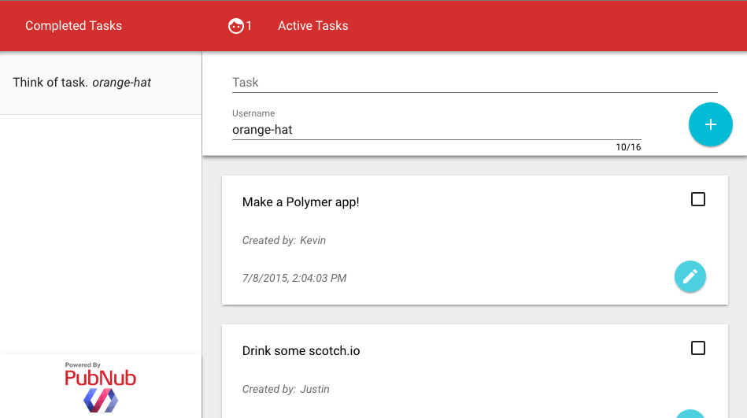
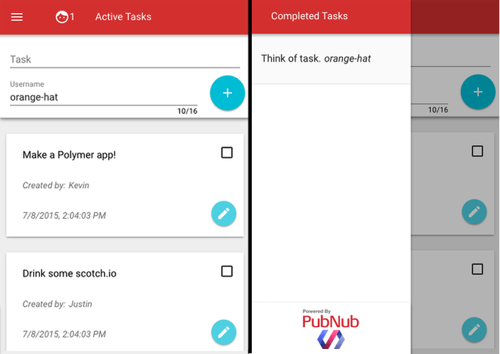

## Realtime Polymer To-Do App

__A realtime collaborative to-do app made using [Polymer 1.0](https://www.polymer-project.org/1.0/) and [PubNub](http://www.pubnub.com/).__

## Intro to Polymer

If you kept up with Google I/O 2015, then you likely saw that Polymer 1.0 has been released to the public. If you have been around since Polymer 0.5, then you likely saw that all your favorite building blocks have been deprecated. For all those who have used 0.5, consider this a migration assistant. Those of you who have never seen Polymer before, you're in for a treat!

[Polymer](https://www.polymer-project.org/1.0/) is a library that leverages [web components](http://webcomponents.org) to allow you to define and use custom HTML elements. With custom elements, designing and building a website becomes a game of Legos. Polymer 1.0 replaces the shadow DOM polyfill with a lightweight shim, reduces the code size, and speeds up data-binding for an all around smoother experience.

The beauty of making an app with polymer is the responsive material design that looks beautiful on all screen sizes from TVs to mobile!

## Running The Demo

### 1. Clone this Repository

This repo has all the used elements downloaded so you do not have to run a bower install. However, all dependencies are saved in the bower.json file, so if you want to update them it is simple using `bower update`.

### 2. Serve the Files on Localhost

If you try to open `file://<your-polymer-project>` in your browser, you will likely run into Cross-Origin Resource Sharing (CORS) errors since the browser will block your requests to use video and microphone features. To test your code you have a few options. You can upload your files to a web server, like [Github Pages](https://pages.github.com/) if you prefer. However, to keep development local, I recommend you setup a simple server using Python.

To so this, open your terminal and change directories into your current project and depending on your version of Python, run one of the following modules.

	cd <project-dir>

	# Python 2
	python -m SimpleHTTPServer <portNo>
	
	# Python 3
	python -m http.server <portNo>
	
For example, in Python2.7 if you run `python -m SimpleHTTPServer 8001`, you can go to `http://localhost:8001/index.html` to test the app!
