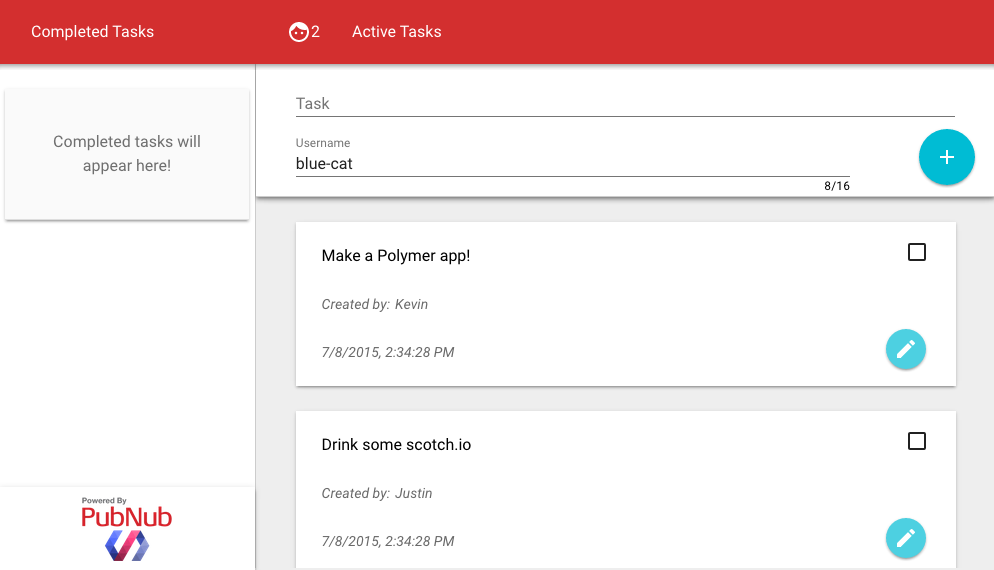

## A Polymer ToDo App

If you kept up with Google I/O 2015, then you likely saw that Polymer 1.0 has been released to the public. If you have been around since Polymer 0.5, then you likely saw that all your favorite building blocks have been deprecated. For all those who have used 0.5, consider this a migration assistant. Those of you who have never seen Polymer before, you're in for a treat!



The elements that I use in this demo are:

- `paper-checkbox` to check off a task 
- `iron-input` to handle input binding functionality
- `paper-input` for a Material Design input
- `paper-drawer-panel` to provide the app structure (in place of the `core-scaffold` of v0.5)
- `paper-button` for a good looking button
- `paper-fab` for the round floating action buttons
- `paper-menu` to create a nice sidebar of completed tasks
- `iron-icons` to provide material icons for buttons

These can be installed with the following lines in the terminal.

	$ bower install polymerelements/paper-checkbox#^1.0.1
	$ bower install polymerelements/iron-input#^1.0.0
	$ bower install polymerelements/paper-input
	$ bower install polymerelements/paper-drawer-panel
	$ bower install polymerelements/paper-button
	$ bower install polymerelements/paper-fab
	$ bower install polymerelements/paper-menu
	$ bower install polymerelements/iron-icons
	
Now you are ready to import and use these elements to make a custom element of your own!

## 2. Creating Custom To-Do Element

The entire contents of my `index.html` file can fit on less than 10 lines.

```
<html>
<head>
	<meta name="viewport" content="width=device-width, initial-scale=1">
	<script src="bower_components/webcomponentsjs/webcomponents-lite.min.js"></script>
	<link href="elements/todo-app.html" rel="import">
</head>
<body fullbreed unresolved>
	<todo-app></todo-app>
</body>
```

Add the `<meta name="viewport" content="width=device-width, initial-scale=1">` to your `<head>` tag to properly display your app on mobile devices. From there you can see the `webcomponents` file and a custom element that defines our app. `<body fullbreed unresolved>` tells the Polymer that the body should take up the full screen, and wait until all elements are resolved (loaded) before displaying anything, preventing [FUOC](https://en.wikipedia.org/wiki/Flash_of_unstyled_content).

### 2.1 Structure of Custom Elements


Since this guide is to show the functionality of Polymer 1.0 and not to cover basic CSS, I will leave the styling to you. If you wish to see my stylesheets, [check the repo][Repo].

```
<!DOCTYPE html>
<html>
<head>
	<link href="../bower_components/polymer/polymer.html" rel="import">
	<!-- Element Imports -->
</head>

<dom-module id="element-name">
  <style>
  	/* CSS rules for your element */
  </style>
  <template>
    <!-- local DOM for your element -->
	...
  </template>
</dom-module>
<script>
  Polymer({
    is: "element-name",
    properties: {
    	...
    	},
	ready: function(e){
		...
	}
  });
</script>
```

This is the basic layout of any custom element. `<dom-module>` is the Polymer 1.0 version of `<polymer-element>`, it is the root of your custom element. An element's styles are local, so add them between the style tags, and between the `<template>` tags are where the bulk of our element will go. The `Polymer({})` script is where you write the logic to your element. `is` is how you register your element as a Polymer element. Any attribute of your element should be declared in `properties`, we will cover this shortly though.

### 2.2 Importing Elements

As I said earlier, you must import an element before using it. Create a new folder and file in your project directory `/elements/todo-element.html`. Then, in `todo-element.html` add the standard template from above, and import the following elements:

```
<head>
	<link href="../bower_components/polymer/polymer.html" rel="import">
	<link href="../bower_components/paper-checkbox/paper-checkbox.html" rel="import">
	<link href="../bower_components/paper-item/paper-item.html" rel="import">
	<link href="../bower_components/paper-input/paper-input.html" rel="import">
	<link href="../bower_components/paper-material/paper-material.html" rel="import">
	<link href="../bower_components/iron-icons/iron-icons.html" rel="import">
	<link href="../bower_components/paper-fab/paper-fab.html" rel="import">
</head>
```

This will import all the elements we use. Now, lets configure our template. The `<paper-fab>` action button uses an `icon` property to select icons, [see all possible icons here][Icons].

```
<template>
  <paper-material class="todo">
    <paper-checkbox checked="{{completed}}"></paper-checkbox>
    <paper-fab hidden={{editing}}  icon="icons:create" on-tap="doEdit" mini></paper-fab>
    <paper-fab hidden={{!editing}} icon="icons:done"   on-tap="doEdit" mini></paper-fab>
    <paper-item hidden="{{editing}}" id="task">{{task}}</paper-item>
    <paper-input id="edit" hidden="{{!editing}}" value="{{task}}"></paper-input>
    <paper-item>Created by: <span>{{user}}</span></paper-item>
    <paper-item>{{time}}</paper-item>
  </paper-material> <!-- data bindings in local DOM -->
</template>
```

Time for a crash course in data binding for those who have never used Polymer before. Any time `{{}}` is used, it is binding a property. Whatever value that property has will be placed where the curly braces are. Now, lets define those properties.

```
 <script>
  Polymer({
    is: "todo-element",
    properties: {
    	// declare properties for the element's public API
		user: {
			type: String,
			value: ""	
		},
		task: {
        	type: String,
			value: "Hello!"
    	},
    	rid: {
	    	type: Number,
	    	value: -1
    	},
    	time: {
	    	type: String,
	    	value: new Date().toLocaleString()
    	},
		completed: {
	    	type: Boolean,
			value: false,
			observer:'compChanged'
    	},
    	editing: {
	    	type: Boolean,
	    	value: false	
    	}
    },
    compChanged: function(e){
	    if(e){ this.fire('complete',this); }
    },
    doEdit: function(e){
    	this.editing=!this.editing;
	},
  });
</script>
```

Here you can see how a property is declared. Name the property, state its type and default value. Now for binding, `<paper-item hidden="{{editing}}" id="task">{{task}}</paper-item>` will be hidden the moment we modify the property editing to be `true`. This happens once `doEdit` is called. Note that properties in polymer native syntax, such as `on-tap="doEdit"` do not require curly braces, and any plain text such as `<span>{{user}}</span>` needs to have a tag directly around it in order to render. Bindings are two-way. This means that if I modify the `<paper-input value="{{task}}">` and change the value, task's value will be updated accordingly. 

Lastly, take note of the `completed` property. there is an observer, or a function that will be called once the value of `completed` is changed. To communicate with other elements, this code just `fires` a `complete` event with our completed task as the tag. This will be important later. If you would like to learn more about properties and property binding, see the [official documentation](https://www.polymer-project.org/1.0/docs/devguide/properties.html).

Our properties include:
- user: The person who posted or completed a task
- task: The task that is being posted
- rid: A random ID that will be used to coordinate tasks via PubNub
- time: The time of creation of the task
- completed: Whether or not the task is complete
- editing: If the user is editing the task

Now, we have a complete To-Do element. Time to use it to make our application.

## 3. Creating Your App

Our `index.html` only had one element, our `<todo-app>`, so now let's make that element! Create a file in `/elements/todo-app.html`.

### 3.1 App Imports

We can import our custom element just like any other, using `<link href="../elements/todo-element.html" rel="import">`. Now we should import all elements we are going to use in our app, and set it up as a Polymer element.

```
<head>
	<link href="../bower_components/polymer/polymer.html" rel="import">
	<link href="../elements/todo-element.html" rel="import">
	<link href="../bower_components/paper-drawer-panel/paper-drawer-panel.html" rel="import">
	<link href="../bower_components/paper-header-panel/paper-header-panel.html" rel="import">
	<link href="../bower_components/paper-toolbar/paper-toolbar.html" rel="import">
	<link href="../bower_components/paper-icon-button/paper-icon-button.html" rel="import">
	<link href="../bower_components/paper-material/paper-material.html" rel="import">
	<link href="../bower_components/paper-menu/paper-menu.html" rel="import">	
	<link href="../bower_components/paper-item/paper-item.html" rel="import">
	<link href="../bower_components/paper-input/paper-input.html" rel="import">
	<link href="../bower_components/iron-icons/iron-icons.html" rel="import">
	...
</head>
<dom-module id="todo-app">
	<style> ... </style>
	<template> ... </template>
</dom-module>
< script> ... </script>
```

### 3.2 Basic Structure

The `paper-drawer-panel`, `paper-header-panel` and `paper-toolbar` are all used to structure our application and make it adapt to different screen sizes. They replace the `core-scaffold` of Polymer 0.5. 

The basic structure of the `paper-drawer-panel` is:

```
<paper-drawer-panel>
	<paper-header-panel drawer>
		<paper-toolbar>
			<paper-item>Side Bar Title</paper-item>
		</paper-toolbar>
		<!-- Side Bar Content -->
	</paper-header-panel>
	<paper-header-panel main>
		<paper-toolbar>
			<paper-item>Main Body Title</paper-item>
		</paper-toolbar>
		<!-- Body of Element -->
	</paper-header-panel>
</paper-drawer-panel> 
```


### 3.3 Create Your Side Bar


I will start by covering my Side Bar Content. This can all go in the `<template>` tag of your element.

```
<paper-menu class="list">
	<template is="dom-if" if="{{!done.length}}">
		<paper-material>
			<paper-item>Completed tasks will appear here!</paper-item>
		</paper-material>
	</template>
	<template id="done" is="dom-repeat" items="{{done}}">
		<paper-item>{{item.task}}<i style="margin-left: 5px;">{{item.user}}</i></paper-item>
	</template>
</paper-menu>
```

__Conditional Templates__

This snippet covers a lot of Polymer's new features so follow carefully. `Templates` are used internally to add functional properties such as loops and conditionals to your elements. `<template is="dom-if" if="{{!done.length}}">` means that it is functioning as an `if` statement, on the condition of the array `done`'s length. If done is empty, this reads `not 0` which evaluates to `true`, and thus it will only display when the array is empty, and disappear as soon as the array is populated. 

__Looping Templates__

`<template id="done" is="dom-repeat" items="{{done}}">` is an effective way to loop through and display an array's contents. The `dom-repeat` means it will loop through every element of `items` (the done array in this case), much like a for-each loop. It names each element of the array `item` so if item is `{task:"SIT", user:"lazy-cat"}`, you can access properties as `{{item.task}}` and `{{item.user}}`. There is an option to set `as="myTask"` in the template tag to name elements, and then you can use `{{myTask.task}}`;

### 3.4 Main Body Content

Now onto the Main Body of the Element. This can be styled or structured however you would like, but I tried using as many `paper-elements` as possible since my eye for style is blind.

```
<div style="border-left: 1px solid #ccc;">
	<!-- To create a new Todo -->
	<paper-material id="todoEntry">
		<paper-input id="tTask" label="Task"></paper-input>
		<paper-input id="tUser" char-counter label="Username" maxlength="16"></paper-input> 
		<paper-fab icon="icons:add" on-tap="postTask"></paper-fab>
	</paper-material>
	<div id="todos">
		<template is="dom-if" if="{{!todo.length}}">
			<paper-material>
				<paper-item>No Tasks remain. Updates are Real-Time so stay tuned!</paper-item>
			</paper-material>
		</template>
		<template id="tasks" is="dom-repeat" items="{{todo}}">
			<todo-element user="{{item.user}}" task="{{item.task}}" rid="{{item.rid}}"></todo-element>
		</template>
	</div>
</div>
```

This looks somewhat similar to the side menu. There are still conditional and repeating templates to display all tasks in the `todo` array. There is a function that we will need to define called `postTask` that is triggered `on-tap` of the add action button. The `paper-input` element uses a `char-counter` to display number of letters typed. See more custom properties of this element in [the element catalog](https://elements.polymer-project.org/elements/paper-input). Again, to view all possible icon choices for the `<paper-fab>` [look here][Icons].

### 3.5 Implementing Your Element

```
Polymer({
    is: "todo-app",
    properties: {
		todo: {
			type: Array,  // Default with one value
			value: [{user:"Coder",task:"Learn Polymer",rid:0}]
		},
		done: {
			type:Array,
			value: []
		},
    },
    postTask: function(e) {  // Add a new task
	    var tsk = this.$.tTask.value;
	    var usr = this.$.tUser.value;
	    if (tsk==""){
		    alert("Task is Empty!");
		    return;
		}
	    if (usr==""){ 
	    	usr = "Anonymous";
	    }
	    this.$.tTask.value = "";
	    //Will need to publish the task in Part 4
    },
    handleComplete: function(e){
	    var idx = findWithAttr(this.todo, 'rid', e.target.rid);
	    var itm = this.todo[idx];
	    itm.task = e.target.task;		//Task of the fired event
	    itm.user = this.$.tUser.value; //User who completed task
	    itm.type = "done";				//Change to completed
	    // Will Publish completed item in Part 4
    },
    ready: function(e){
		this.addEventListener('complete', this.handleComplete);
	}
});
function randID(){  // RandID is just a large number, could be better.
	return Math.floor(Math.random()*10000);
}
function findWithAttr(array, attr, value) { //Finds object index in array by its random ID
	for(var i = 0; i < array.length; i += 1) {
	    if(array[i][attr] === value) {
	        return i;
	    }
	}
}
```

This is the first we have see how to access the value of something in your element's [Shadow DOM](https://www.polymer-project.org/0.5/platform/shadow-dom.html). After declaring our `task` and `done` arrays, we get the value of our `<paper-input id="tTask">` using `var tsk = this.$.tTask.value;`. Pretty simple! We will publish our task with PubNub in part 4, but for now take a look at the `ready` function. This is called once our element is loaded and ready to be rendered. We add an event listener for the `completed` which we fired from our custom `todo-element`. We handle it by updating its fields for who completed the task, and we will then publish to all collaborators.

## 4. Making It All Collaborative

Welcome to my favorite part, the real-time collaboration! In order to start streaming tasks and completions, you will need a publish and subscribe key. To get your pub/sub keys, you’ll first need to [sign up for a PubNub account](http://www.pubnub.com/get-started/). Once you sign up, you can find your unique PubNub keys in the [PubNub Developer Dashboard](https://admin.pubnub.com). The free Sandbox tier should give you all the bandwidth you need to build and test your Collaborative To-Do Application.

### 4.1 The PubNub Element

PubNub has a Polymer element pre-made. The `<pubnub-element>`. Once you have your keys the `<pubnub-element>` can be downloaded using Bower.

	$ bower install --save pubnub-element
	
To import this element in your `todo-app.html`, using the following line:

```
<link rel="import" href="../bower_components/pubnub-polymer/pubnub-element.html">
```

#### 4.2 Using the PubNub Element

You can initialize the PubNub client using the `<core-pubnub>` element with your keys. Inside the `<core-pubnub>` we will use a `<core-pubnub-publish>` element to stream new and completed todo objects.

_Note: this element should be the last tag in the `<template>` of your `<pub-control>` element._

```
<template>
...
	<core-pubnub 
		publish_key="your_pub_key" 
		subscribe_key="your_sub_key">
		<core-pubnub-publish id="pub" channel="todo" message="Test"> </core-pubnub-publish>
		<core-pubnub-subscribe id="sub" channel="todo" messages="{{messages}}" presence="{{present}}" on-callback="subscribeCallback"></core-pubnub-subscribe>  
	</core-pubnub>
</template>
```

`<core-pubnub-publish>` is used to send messages to all subscribers of a channel. We set the channel to "todo", so all subscribers of `todo` will receive tasks. Then, to publish a message, we need to access the `<core-pubnub-publish>` as follows.

```
this.$.pub.message = {"task":"<task>", "user":"<user>", "rid":<rid>};
this.$.pub.publish();
```

We can go back and update `handleComplete` and `postTask` as follows so that they will publish their updates:

```
handleComplete: function(e){
	...
	this.$.pub.message = itm;
	this.$.pub.publish();
},
postTask: function(e) {
	...
	this.$.pub.message = {type:"todo", task:tsk, user:usr, rid:randID()};
	this.$.pub.publish();
}
```

The `<core-pubnub-subscribe>` will subscribe us to channel `todo` so we are receiving all those publishes, but notice that it takes two values of `messages` and `presence`. These are arrays. When the PubNub Element receives a message or presence update, it will put it in the array and fire a `message` or `presence` event respectively. It also takes a `on-callback` which is triggered any time a subscribe event occurs. We can implement that like so:

```
properties: {
	...
	messages: {
		type: Array,
		value: []
	},
	present: {
		type: Array,
		value: []
	}
},
...,
subscribeCallback: function(e){
    while(this.messages.length > 0){ // Get all messages
	    var item = this.messages.pop();
	    switch(item.type){
		    case "todo":
		    	this.unshift('todo', {task:item.task, user:item.user, rid:item.rid});
		    	break;
		    case "done":
		    	var idx = findWithAttr(this.todo, 'rid',item.rid);
			    var itm = this.splice('todo', idx, 1)[0];
			    itm.task = item.task;
			    itm.user = item.user;
			    this.push('done',itm);
			    break;
			default:
				continue;
	    }
    }
}
```

This will check if a new todo is being broadcasted, or an old one is being completed. Polymer uses its own methods to update arrays. Array.pop() will not notify Polymer that a change has occurred, so the elements you see won't be updated. Therefore it uses `this.pop('arrayName')` (also `push`, `shift`, `unshift`, etc). So we use `this.unshift('todo', ourJSON);` to add a task to the beginning of the `todo` array, which is then updated from our `dom-repeat` in Step 3. 

### 4.3 BONUS: Real-Time Presence


Go to your [PubNub Developer Dashboard](https://admin.pubnub.com) and enable the free 30-day trial of Presence for this part, trust me it's worth it. We now have subscribe and publish working perfectly! Anywhere in your paper-toolbar, (I chose before the Main Body Title), add an icon and a number to indicate how many people you are collaborating with.

```
<paper-item>
	<iron-icon icon="icons:face"></iron-icon>
	<span id="here">0</span>
</paper-item>
```

Take a look at how simple it is to update the number of real-time users in your Polymer app:

```
this.addEventListener('presence', presChange);
function presChange(e){
	var pres = this.present.pop()
	this.$.here.innerHTML = pres.occupancy;
}
```

Done. The number will update live and show you how many users are currently using your application.

That's all I have this time, we can check that one off the to-do list, **bad joke drum sound*. I'll be back soon with another cool PubNub demo and better jokes!

[Repo]:https://github.com/GleasonK/Polymer-Todo
[Polymer]:https://www.polymer-project.org/1.0/
[WebComponents]:http://www.w3.org/wiki/WebComponents/
[Install]:https://www.polymer-project.org/1.0/docs/start/getting-the-code.html
[Elements]:https://elements.polymer-project.org
[Icons]:http://kevingleason.me/Polymer-Todo/bower_components/iron-icons/demo/index.html
